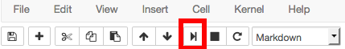

# Pre-course instructions
In this short course on programming for data analysis we’ll be using the Python programming language. All programming languages come as the basic language and a bunch of modules/libraries that extend the language and make it easier to use (easier is a relative term here - but python is pretty easy).

## Installing the Anaconda python distribution
The easiest way to get python up and running on your system is to install a ‘pre-packaged’ version that comes with bells and whistles. We’ll use the Anaconda Python distribution.

Follow this link to the download page:

http://continuum.io/downloads

You should be offered the appropriate package for your system (mac or pc - if you’re using  linux I assume you mostly know what you’re doing and you’ll have python already on your system anyway).

Select the graphical installer for Python 3.x (where x will be some number). Do **not** select Python 2.x!

Download and follow the prompts to install.

After you’ve installed you should have an icon somewhere for the Launcher or Anaconda Navigator.


Run the launcher and install any updates required.

Launch the jupyter-notebook which will open in your browser and click new (top right hand corner). 


In the first empty cell type:
```python
print(“Success”)
```


Press the play button at the top of the notebook.



You should see the word “Success” printed. If so, good… you can close the notebook and the terminal/console (if the terminal/console is open press the Ctrl key and the c key at the same time twice then close the terminal).

If this hasn't worked we’ll hopefully deal with it when the course starts.

## Folder setup

It will help to set up a folder/directory for the course. So somewhere on your hard drive create a folder called e.g. python_course or something equally imaginative. We’ll use that to store the data we’ll deal with during the course.

If you'd like to try out both python and Atom then click [here](https://gitlab.com/iaingallagher/BasicPython/blob/master/Week1%20-%20Getting%20started.ipynb) to be taken to a simple exercise to give you a look at using python, the jupyter notebook (more about that during the course) and Atom.
